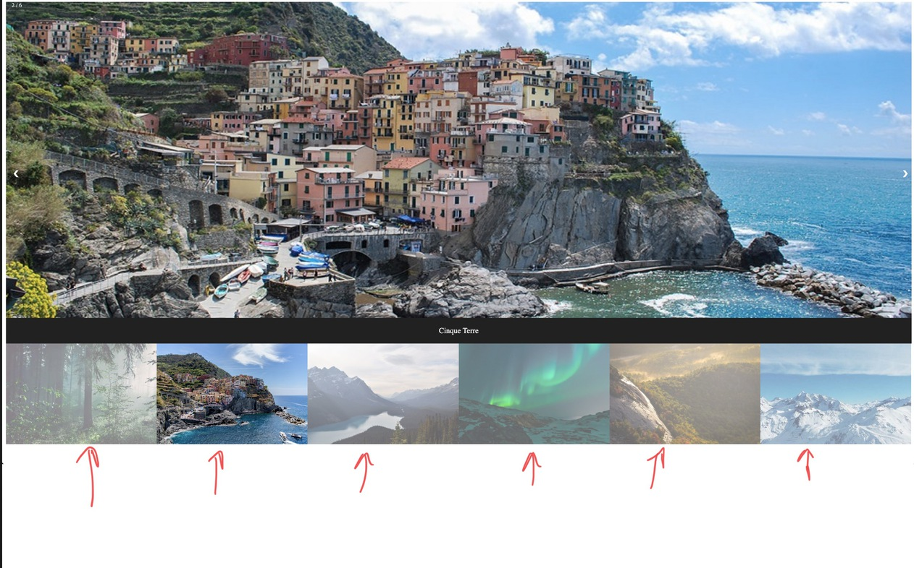
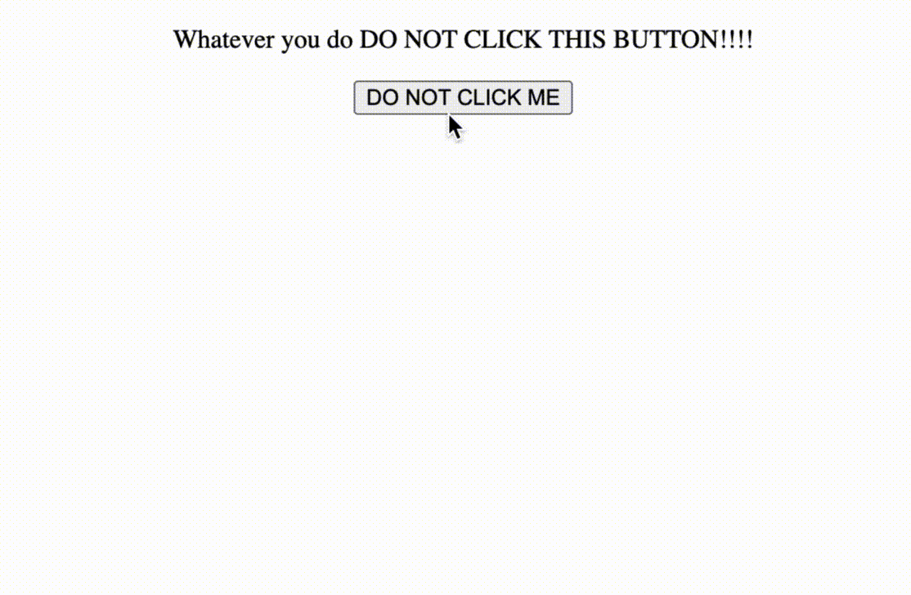

# Lets make a slide show


## The html

### `<html>`, `<head>` & `<body>` elements

First we are going to start off with our html document. This tells the browser where to start reading html, although it will still read anything you put inside of a file with a .html extention it's best practice to do this 
```html
<html>
</html>
```

Then we are going to add a `<head>` and a `body` tag within our html tags. 
Elements within the `<head>` tag are not rendered to the user. The `<head>` tag is where we are going to link our css and javascript files so we still need it.  wElements within the `<body>` tag **are** rendered to the user


```html
<html>
    <head>
        <!-- Links and stuff not rendered to the user -->
    </head>
        <body>
            <!-- Where our content will be rendered to the user -->
        </body>
</html>
```


Add a `<div>` element with the class `container` within the `<body>` body elements. The `class` key word is an html attribute.

```html
    <body>
        <div class="container">
    </body>
```

But what is an HTML attribute?

- Attributes add functionality to HTML elments. All HTML elements can have attributes
    - The href attribute of `<a>` specifies the URL of the page the link goes to
    - The src attribute of `` specifies the path to the image to be displayed
    - The width and height attributes of `` provide size information for images
    - The alt attribute of `` provides an alternate text for an image
    - The style attribute is used to add styles to an element, such as color, font, size, and more
    - The lang attribute of the `<html>` tag declares the language of the Web page
    - The title attribute defines some extra information about an element

So what does the `<div>` element do and how does the `class="container"` attribute effect it? 

`<div>` is an arbitrary element that is used to define divisions in the sections of an HTML document, The resson we add the `class="container"` attribute to it is so we can later access that element and its nested contents when modifying the document with CSS and javascript. 

### Adding the large images

Make sure to close the `<div class="containter">` element with a closing `</div>` tag. Then add another `<div>` element with the class 
`mySlides`. 

```html 
 <div class="mySlides">

 </div>
```

Within this div we are going to add another div with the class `numbertext` and close it on the same line

```html
    <div class="mySlides">
        <div class="numbertext"> </div>
    </div>
```
Then under that div we are going to add an `` element which will render our image to the user. It needs two attributes.
-  The `src` attribute will be the filepath to the image we want to display 
-  The `style` attribute allows for inline CSS (Cascading Style Sheets) in this case the css makes sure the rendered image takes up 100% of the users screen. 

```html
    <div class="mySlides">
        <div class="numbertext"></div>
        
    </div>
```

Do this for each file in the `imgs` directory ending with the word `wide` . Can anyone guess why we need two seprate image sizes?


### Adding thumbnail images



The process for adding the the thumbnails to our image carrosell is similar to what we did with the bigger images except:

- This time we are wrapping all of the elements in a div with a class `row` and each nested div is going to have a class of `column`

```html
<div class="row">
  <div class="column">
    <!-- where are img element will go -->
  </div>
</div>
```
- This time the `` element will have three new attributes
    - `class` with the value of `demo cursor`
    - `alt` with a value that will describe what is in the image 
    - `onclick` with the value of `currentSlide(1-6)`

It will look like this:

```html
    <div class="column">
        
    </div>
    <div class="column">
        
    </div>
    <div class="column">
        
    </div>
```
So what does the `onclick` attribute do? 

similar to the way the `style` tag allows you to use CSS, the `onclick` attributes ***triggers*** javascript code. 



To try this out by throwing the following snippet into an html file and open it on your desktop 

```javascript
<!DOCTYPE html>
<html>
  <head>
    <style>
    body {
      text-align: center;
    }
  </style>
  </head>
<body>

<p>What ever you do, DO NOT CLICK THIS BUTTON!!!!</p>

<button onclick="myFunction()">DO NOT CLICK ME</button>

<script>
function myFunction() {
  var x = document.createElement("P");
  var t = document.createTextNode("STOP");
  x.appendChild(t);
  document.body.appendChild(x);
}
</script>

</body>
</html>

```

 Notice how we didn't have to spin up a webserver to do that? 


